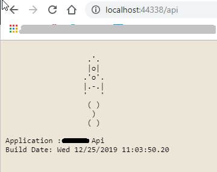
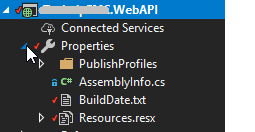
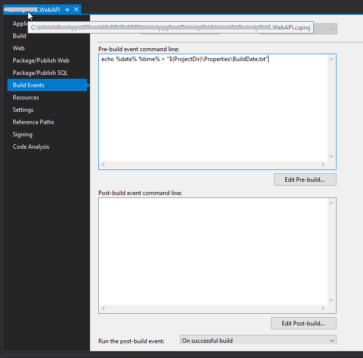

#  Visual Studio 2019

## Ignore npm install in Visual Studio 2019.
-  goto ```Tools > options ``` search for `Package Restore`.Set `Restore On Project Open` to **False** and  `Restore On Save` to **False**.

## Add Build Date to project 

- Add build date to project,which can be helpful in future to know when was the project build.
1. Add File called *BuildDate.txt* to Properties Folder 


2. Go to project settings by Right clicking project -> Build Events -> "Pre-build event command line" add ```echo %date% %time% > "$(ProjectDir)\Properties\BuildDate.txt"```


3. File contents can be accessed thru Properties object.
example:
```csharp
var buildDate = Properties.Resources.BuildDate;
Context.Response.Write($"\nBuild Date: {buildDate}\n");
```